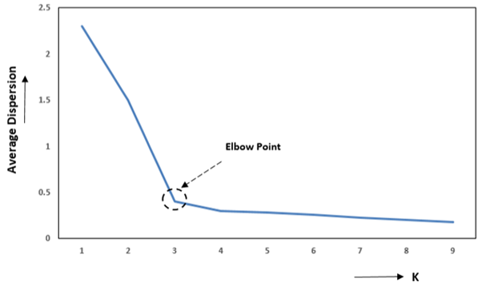

### 1. Labeled vs Unlabeled Data 

**Labeled Data:** 
Labeled data refers to a dataset where each input sample is associated with a known output label or 
target value. These labels guide the learning process in supervised learning algorithms (e.g., 
classification — assign one of several classes, or regression — predict a continuous value). 

For example, in an email spam detection system, each email in the dataset may be labeled as “Spam” 
or “Not Spam.” The algorithm learns patterns from these labeled examples to classify new emails. 

**Unlabeled Data:** 
Unlabeled data refers to a dataset where only input features are available and no output labels or 
predefined categories are provided. Since there are no target values, the algorithm must 
automatically identify patterns, structures, or relationships present in the data. This type of data is 
commonly used in unsupervised learning. 

A common technique used to analyze unlabeled data is clustering, where the algorithm groups 
similar data points into clusters based on their characteristics. 

For example, a dataset contains age and income of customers, but no information about customer 
categories. A clustering algorithm can group them into clusters such as high-income, medium-income, and low-income customers based on similarity. 

### 2. Introduction to Clustering 
Clustering is the process of grouping similar data points into clusters so that points within a cluster 
are more similar to each other than to those in other clusters. Clustering is commonly used to 
explore a dataset to either identify the underlying patterns in it or to create a group of 
characteristics. 

Clustering has many practical applications, including: 
- Customer segmentation in marketing 
- Document grouping in text mining 
- Image segmentation in computer vision 
- Anomaly detection in fraud detection systems 

### 3. Introduction to K-Means Clustering 
K-Means is one of the most widely used unsupervised clustering algorithms. It belongs to the 
category of partition-based clustering algorithms. The main objective of K-Means is to divide a 
dataset into K distinct clusters, where each cluster is represented by a central point called the 
centroid. 

The algorithm works by assigning each data point to the cluster whose centroid is closest to it, 
usually measured using Euclidean distance. As the algorithm progresses, the positions of centroids 
are updated so that they represent the mean position of all data points within the cluster. [🔗](https://www.geeksforgeeks.org/machine-learning/k-means-clustering-introduction/)

### 4. Geometrical Interpretation of K-Means 
From a geometric perspective, each data point in a dataset can be represented as a point in a feature 
space. For example, if the dataset has two features such as height and weight, each observation can 
be plotted as a point in a two-dimensional coordinate plane. 

In K-Means clustering, each cluster is represented by a centroid, which acts as the center of the 
cluster. The algorithm measures the distance between each data point and the centroids (using 
Euclidean distance) and assigns the point to the nearest centroid. 

As a result, the entire feature space is partitioned into regions, where each region corresponds to a 
cluster. Every data point within a region belongs to the cluster whose centroid is closest to it. During 
the iterative process, centroids move to the mean position of the points assigned to them, gradually 
forming well-defined clusters. 

### 5. Mathematical Representation 
In K-Means clustering, the similarity between data points and cluster centroids is measured using a 
the Euclidean distance. The Euclidean distance between two points 
<i>A</i>(<i>X</i>1, <i>Y</i>1) and 
<i>B</i>(<i>X</i>2, <i>Y</i>2) is given 
by: 

    
        d(A, B) =
        &radic;
        (X2 &minus; X1)2 + (Y2 &minus; Y1)2
    

This distance measure helps determine which centroid a data point is closest to, and accordingly the 
point is assigned to that cluster. 

The main objective of the K-Means algorithm is to minimize the total within-cluster variance, which 
indicates how far the data points in a cluster are from their corresponding centroid. A lower variance 
means that the data points are closer to the centroid, resulting in more compact clusters. 

The algorithm minimizes the sum of squared distances between each data point and its cluster 
centroid. This objective function is expressed as: 

    
        <i>J</i>(<i>K</i>) = 
        

            <i>K</i>
            &Sigma;
            <i>k</i>=1
        

        

            <i>&nbsp;</i>
            &Sigma;
            <i>xi</i> &isin; <i>Ck</i>
        

        ||<i>xi</i> &minus; <i>&mu;k</i>||2
    

Where: 
- **<i>J</i>(<i>K</i>)** = Cost function for *K* clusters 
- **<i>Ck</i>** = Cluster *k* 
- **<i>xi</i>** = Data point 
- **<i>&mu;k</i>** = Centroid (mean) of cluster *k* 

### 6. K-Means Clustering Algorithm 
- **Step 1:** Choose K (number of clusters) 
- **Step 2:** Initialize K centroids: 
    - **Random:** Pick K random data points as initial centroids 
    - **Pick first centroid randomly:** for each subsequent centroid, pick point with probability proportional to squared distance from nearest existing centroid. 
- **Step 3: REPEAT until convergence:** 
    - **Step 3a: Assignment Step** 
        - For each data point: 
            - Calculate distance to all K centroids 
            - Distance formula: 
              

                  
                      d =
                      &radic;
                      (x1 &minus; c1)2 + (x2 &minus; c2)2 + ...
                  
              

            - Assign point to cluster with nearest centroid 
    - **Step 3b: Update Step** 
        - For each cluster k: 
            - Calculate new centroid as mean of all points in cluster 
            - New centroid coordinates = 
              
              (&Sigma;<i>xi</i>/<i>n</i>, &Sigma;<i>yi</i>/<i>n</i>, ...)
              
    - **Step 3c: Check Convergence** 
        - If centroids haven't moved (or moved less than threshold) then **STOP** 
        - If maximum iterations reached then **STOP** 
        - Otherwise, repeat from Step 3a 
- **Step 4:** Output final cluster assignments and centroid positions 

### 7. Choosing the Number of Clusters: Elbow Technique 
One of the key challenges in K-Means clustering is selecting the appropriate number of clusters (K). 
Choosing too few clusters may group dissimilar data points together, while too many clusters may 
lead to unnecessary fragmentation of the data. 

A commonly used method to determine a suitable value of K is the Elbow Method. In this technique, 
the K-Means algorithm is run multiple times using different values of K, and for each value the 
Within-Cluster Sum of Squares (WCSS) is calculated. 

The WCSS measures how closely the data points in a cluster are grouped around their centroid. By 
comparing WCSS values for different numbers of clusters, it becomes possible to identify an 
appropriate number of clusters for the dataset.  [🔗](https://www.scaler.com/topics/machine-learning/k-means-clustering-in-machine-learning/)

### 8. Mathematical Relation in Elbow Method 
The Within-Cluster Sum of Squares (WCSS) is a measure used to evaluate the compactness of clusters 
in K-Means clustering. It represents the sum of squared distances between each data point and the 
centroid of the cluster to which it belongs. A smaller WCSS value indicates that the data points are 
closer to their cluster centroid, meaning the clusters are more compact. 

Mathematically, WCSS is defined as: 

    
        <i>WCSS</i> = 
        

            <i>K</i>
            &Sigma;
            <i>k</i>=1
        

        

            <i>&nbsp;</i>
            &Sigma;
            <i>xi</i> &isin; <i>Ck</i>
        

        ||<i>xi</i> &minus; <i>&mu;k</i>||2
    

Where: 
- **<i>Ck</i>** = cluster *k* 
- **<i>xi</i>** = data point 
- **<i>&mu;k</i>** = centroid of cluster *k* 

As the number of clusters (K) increases, the WCSS value generally decreases because data points are 
divided into smaller groups and are closer to their respective centroids. 

However, after a certain value of K, the decrease in WCSS becomes much smaller. The objective is to find the point where the reduction in WCSS starts to slow down significantly, indicating that adding more clusters does not substantially improve the clustering quality. This point is used to determine the optimal number of clusters. 

### 9. Geometrical Interpretation of the Elbow Method 
The elbow method involves plotting: 
- Number of clusters (K) on the x-axis 
- WCSS on the y-axis 

 
<strong>Figure 1: Elbow Method</strong>

As shown in **Figure 1**, the WCSS decreases rapidly as more clusters are added. However, after a certain value of K, the rate of decrease slows down, and the graph begins to flatten. The point where the curve forms a sharp bend or “elbow” represents the optimal number of clusters. This indicates that adding more clusters beyond this point provides only marginal improvement in clustering performance.

### 10. Merits of K-Means Clustering 
- K-Means is simple to understand and easy to implement. 
- It is computationally efficient, making it suitable for large datasets. 
- The algorithm produces clear cluster representations using centroids, which are easy to interpret. 

### 11. Demerits of K-Means Clustering 
- The algorithm is sensitive to the initial selection of centroids. Different initial centroid positions may lead to different clustering results, and sometimes the algorithm may converge to a local optimum instead of the best solution. 
- K-Means assumes that clusters are spherical and evenly sized. Therefore, it performs poorly when the dataset contains non-spherical clusters or clusters with different shapes and densities. 
- The algorithm requires the number of clusters (K) to be specified in advance, which may not always be known beforehand and can affect the quality of clustering if chosen incorrectly.

